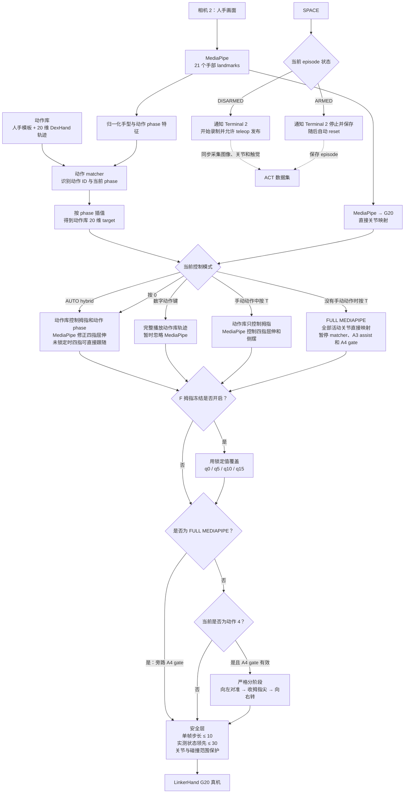
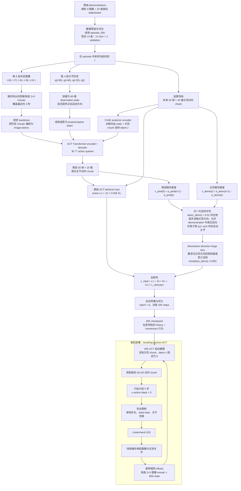
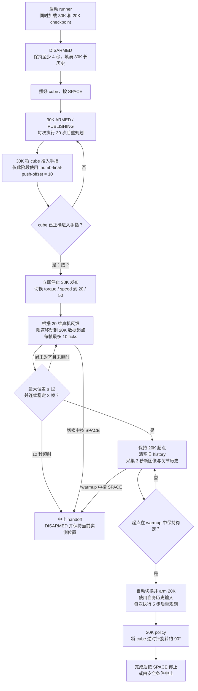

# G20 水平逆时针 90°：键盘动作库 + MediaPipe 数据采集

目标：使用数字键选择动作库轨迹，同时用 MediaPipe 控制四根手指，录制 cube
水平逆时针旋转 `90°` 的 ACT demonstration。相机 0 录制机器人和 cube，相机 2
追踪人手。

当前流程会在录制结束后离线计算 cube 6D pose/yaw。yaw 暂时用于筛选数据，还没有
作为 ACT observation 输入，也没有使用 IK。

同一时间只能运行一个真机 command publisher。开始前关闭官方 GUI、固定动作回放、
其他 teleop、ACT runner 和 cube pose preview。

## Terminal 1：启动 G20 driver

```bash
cd ~/Desktop/Jacky/linker_hand_ros2_sdk
source /opt/ros/jazzy/setup.bash
source .venv/bin/activate
source install/setup.bash

ros2 run linker_hand_ros2_sdk linker_hand_g20_palm_touch \
  --hand_type right \
  --can can0 \
  --is_touch true \
  --touch-fingers with-palm
```

## Terminal 2：启动 ACT recorder

先启动 Terminal 2，看到 `waiting for teleop trigger` 后保持运行，再启动 Terminal 3。

```bash
cd ~/Desktop/Jacky/linker_hand_ros2_sdk
source /opt/ros/jazzy/setup.bash
source .venv/bin/activate
source install/setup.bash

python3 scripts/linkerhand_g20_touch_recorder.py \
  --hand-type right \
  --task-id cube_yaw_ccw90_keyboard_hybrid_v1 \
  --trial-name cube_yaw_ccw90_keyboard_hybrid_v1 \
  --rate 30 \
  --duration 0 \
  --camera 0 \
  --camera-width 640 \
  --camera-height 480 \
  --camera-fps 30 \
  --camera-fourcc MJPG \
  --jpeg-quality 92 \
  --contact-threshold 20 \
  --ros-trigger \
  --require-state \
  --output-dir ~/Desktop/Jacky/sims/linker-hand-teleopt/data/act_demos
```

## Terminal 3：数字键动作库 + MediaPipe teleop

```bash
cd ~/Desktop/Jacky/sims/linker-hand-teleopt
source /opt/ros/jazzy/setup.bash
source ~/Desktop/Jacky/linker_hand_ros2_sdk/install/setup.bash
source .venv/bin/activate

export HW_ENABLE_TOKEN=1

python -m src.comms.action_library_phase_teleop \
  --library data/action_library/g20_right/core_actions_v1 \
  --camera-index 2 \
  --side right \
  --tracking-mode live-pose \
  --control-mode hybrid-fingers \
  --hybrid-unlocked-fingers \
  --freeze-thumb-on-start \
  --startup-thumb-pose "116,253,254,118" \
  --rate 30 \
  --lock-margin 0.015 \
  --no-a23-spread-routing \
  --a3-contact-assist \
  --a3-contact-activate-phase 0.08 \
  --a3-contact-release-phase 0.02 \
  --a3-contact-confirm-frames 2 \
  --a3-contact-threshold-scale 1.60 \
  --a3-contact-competition-slack 0.015 \
  --finger-base-blend 0.15 \
  --finger-tip-blend 0.20 \
  --finger-base-residual-limit 20 \
  --finger-tip-residual-limit 25 \
  --max-range-step 10 \
  --max-state-lead 30 \
  --manual-blend-frames 8 \
  --a4-thumb-tip-gate \
  --a4-left-align-tolerance 5 \
  --a4-left-align-confirm-frames 3 \
  --a4-thumb-tip-tolerance 5 \
  --a4-thumb-tip-confirm-frames 3 \
  --reset-on-start \
  --reset-after-disarm \
  --reset-tolerance 12 \
  --reset-timeout 5 \
  --reset-confirm-frames 3 \
  --current-limit 20 \
  --speed-limit 50 \
  --enable-motion
```

### MediaPipe + 动作库 teleop 流程图



当前命令使用 `--no-a23-spread-routing`，所以“四指并拢时只能动作 2”的 A2/A3
硬路由没有参与这条数据采集流程；A3 contact assist 仍只在 AUTO matcher 路径中工作。

## 每条 episode 的操作顺序

按键焦点必须在 Terminal 3 的 MediaPipe 摄像机窗口。

1. 等待画面显示 `RESET COMPLETE`，此时为 `DISARMED`。
2. 把 cube 放在统一起点，保持 face 5 朝向相机 0。
3. 按需要的数字动作，例如 `2`、`3` 或 `4`，先将动作排队。
4. 按 `T`，确认显示：

   ```text
   MANUAL THUMB + MEDIAPIPE FOUR FINGERS
   ```

5. 人手放在相机 2 中并保持起始姿态，然后按 `SPACE`。Terminal 2 开始录制。
6. 录制期间，大拇指使用当前数字动作的轨迹；四根手指实时跟随 MediaPipe。
7. 需要切换大拇指动作时，按新的数字键，然后重新按 `T`。
8. 将 cube 水平逆时针旋转到约 `+90°`，在终点稳定保持至少 2 秒。
9. 按 `SPACE`：Terminal 2 停止并保存 episode，Terminal 3 自动复位。
10. 重新摆好 cube，重复录制。先录 10 条检查，再补到 30–50 条。

补充按键：

- `F`：冻结/解除按键瞬间的 DexHand 大拇指 `q0/q5/q10/q15`。冻结会跨越
  `SPACE` 停止、`D` 删除和 `--reset-after-disarm` 保持；reset 只移动其余关节。
  需要恢复大拇指控制时必须再按一次 `F`。
- `--freeze-thumb-on-start`：Terminal 3 启动并读到真机 state 后，自动把当时的大拇指
  位置作为基准，因此第一条 episode 不必先按 `F`。
- `--startup-thumb-pose "116,253,254,118"`：使用之前调好并录进
  `20260724_165206_cube_right_flip_from_behind_fingers_v1` 的固定拇指姿态。
  四个绝对 SDK 值依次是 `q0/q5/q10/q15`，不是动作 2 的姿态，也不依赖程序启动时
  拇指当前在 0 还是其他位置。startup reset 会先移动到这组位置，再保持冻结。
  等画面显示 `RESET COMPLETE` 后再开始录制。
- `R`：仅在 DISARMED 时手动开始一次 reset，不启动 ACT recorder；若 `F` 已锁定，
  只复位非拇指关节。
- `0`：返回 AUTO hybrid teleop。
- `D`：仅在 `DISARMED` 且复位完成后，删除当前 session 最新一条 episode。
- `Q` / `ESC`：退出并停止录制。

注意：按 `T` 后，四指屈伸和侧摆 `q1..q4/q6..q9/q16..q19` 都由 MediaPipe
控制。数字 6 是例外：它固定四指并忽略 `T`，只执行动作 2 的拇指往返。

## 录完后：离线计算 cube 6D pose/yaw

先关闭 Terminal 2 和 Terminal 3，再运行：

```bash
cd ~/Desktop/Jacky/sims/linker-hand-teleopt
source .venv/bin/activate

CCW_SESSION=$(ls -dt \
  data/act_demos/*cube_yaw_ccw90_keyboard_hybrid_v1 \
  | head -1)

echo "$CCW_SESSION"

python -m src.comms.annotate_cube_yaw_episodes \
  --session "$CCW_SESSION" \
  --camera-calibration data/calibration/camera0_640x480.json \
  --layout-profile data/calibration/aruco_cube_top_face.json \
  --target-yaw-deg 90 \
  --target-tolerance-deg 5 \
  --yaw-sign 1 \
  --zero-frames 15 \
  --confirm-frames 15 \
  --max-reprojection-error-px 2 \
  --minimum-markers 2 \
  --minimum-valid-ratio 0.70
```

检查输出：

- `episode_*/cube_pose.jsonl`：逐帧 cube 6D pose 和相对 yaw。
- `episode_*/cube_pose_summary.json`：单条 episode 的 `VALID/INVALID` 结果。
- `cube_yaw_session_summary.json`：整个 session 的统计结果。

当前训练器尚未读取 `cube_pose.jsonl` 作为 observation，也不会自动排除
`INVALID` episode；若这里发现失败轨迹，需要像下面排除 `episode_000` 一样增加
`--exclude-source-episode`。

## 训练 21:29 数据：history + momentum ACT

这条命令只读取
`20260724_212905_cube_yaw_ccw90_keyboard_hybrid_v1`，不会混入之前其他方向的
policy 数据。`episode_000` 长 35.8 秒且静止帧比例明显高于其他轨迹，因此从训练
split 排除；其余 14 条保留，其中固定 3 条作为 validation。

```bash
cd ~/Desktop/Jacky/sims/linker-hand-teleopt

~/Desktop/Jacky/ros2_pairlab3-main/.venv_ros2_pairlab3/bin/python \
  scripts/train_g20_visual_act.py \
  --stage all \
  --data-root data/act_demos/20260724_212905_cube_yaw_ccw90_keyboard_hybrid_v1 \
  --include-task-id cube_yaw_ccw90_keyboard_hybrid_v1 \
  --artifact-root artifacts/g20_cube_yaw_ccw90_history_momentum_v1 \
  --repo-id linkerhand_g20_cube_yaw_ccw90_history_momentum_v1 \
  --task "rotate the tagged cube 90 degrees counter-clockwise using visual and motion history" \
  --history-frame-offsets "90,72,54,36,18,0" \
  --state-history-offsets "90,60,30,0" \
  --val-episodes 3 \
  --chunk-size 30 \
  --n-action-steps 5 \
  --momentum-weight 0.2 \
  --momentum-deadband 0.01 \
  --momentum-margin 0.005 \
  --exclude-source-episode "20260724_212905_cube_yaw_ccw90_keyboard_hybrid_v1/episode_000" \
  --steps 20000 \
  --batch-size 8 \
  --num-workers 4 \
  --save-freq 2000 \
  --device cuda \
  --amp
```

这里解决“同一个单帧 observation 有多个 action”的主要输入是：

- 六张历史图像覆盖最近 3 秒：`90,72,54,36,18,0`。
- 四组关节历史明确提供运动方向：`90,60,30,0`。
- momentum loss 使用权重 `0.2`，惩罚预测动作相对示范方向发生反转。

### History + momentum ACT 训练与真机推理流程图



这两个机制解决的是不同问题：

- `history` 是模型的实际输入，训练和真机推理都要使用；它让相同的当前画面可以根据
  前 3 秒图像与关节运动方向得到不同动作。
- `momentum` 只在训练时修改 loss，要求预测 chunk 的局部运动方向跟随 demonstration；
  它的效果已经写入 checkpoint，真机运行时不需要也没有 `--momentum-*` 参数。
- 真机端每次预测 30 帧，但只执行前 5 帧就重新观察和规划，因此仍能根据 cube 的实际
  变化闭环修正。这条配置没有使用 temporal ensemble，也没有加入 IK/FK。

训练完成后的最终 checkpoint：

```text
artifacts/g20_cube_yaw_ccw90_history_momentum_v1/training/checkpoints/020000/pretrained_model
```

## 真机查看 20K checkpoint 效果

先关闭 recorder、MediaPipe teleop 和官方 GUI，只保留 G20 driver。这个模型的示范
起点使用固定拇指 `q0/q5/q10/q15=[116,253,254,118]`；如果灵巧手还保持录制结束后的
reset 姿态，可以直接测试。不要先按 `R`，因为当前 ACT runner 的 `R` 会复位到通用
open pose，而不是这次数据的固定拇指起点。

```bash
cd ~/Desktop/Jacky/sims/linker-hand-teleopt
source /opt/ros/jazzy/setup.bash
source ~/Desktop/Jacky/linker_hand_ros2_sdk/install/setup.bash
export HW_ENABLE_TOKEN=1

~/Desktop/Jacky/ros2_pairlab3-main/.venv_ros2_pairlab3/bin/python \
  -m src.comms.visual_act_to_linkerhand \
  --checkpoint-dir artifacts/g20_cube_yaw_ccw90_history_momentum_v1/training/checkpoints/020000/pretrained_model \
  --camera-index 0 \
  --rate 30 \
  --n-action-steps 5 \
  --max-range-step 10 \
  --ema-alpha 0.10 \
  --current-limit 20 \
  --speed-limit 50 \
  --max-target-delta 180 \
  --max-raw-overshoot 40 \
  --state-stale-seconds 2.0 \
  --max-active-seconds 20 \
  --ignore-touch \
  --enable-motion
```

启动后保持 `DISARMED` 至少 3 秒，让 `[90,72,54,36,18,0]` 图像历史和
`[90,60,30,0]` 关节历史填满。摆好 cube 后让摄像机窗口获得焦点，再按 `SPACE`
开始；动作不对时立即再按 `SPACE` 停止。首次测试保留示范使用的
`current=20/speed=50/max-step=10`，先判断轨迹方向和阶段切换，不要同时提高力度和速度。

## 30K 推入手内，然后按 P 自动切换到 20K 逆时针旋转

这个模式会同时预加载两个 checkpoint。开始时运行旧的 30K flipping policy；cube
被推到手指后按 `P`，程序按真机反馈限速移动到 20K 数据的起点，稳定后原地收集 3 秒
历史，再自动 arm 并执行 20K policy。切换完成后不会再回到 30K。

```bash
cd ~/Desktop/Jacky/sims/linker-hand-teleopt
source /opt/ros/jazzy/setup.bash
source ~/Desktop/Jacky/linker_hand_ros2_sdk/install/setup.bash
export HW_ENABLE_TOKEN=1

~/Desktop/Jacky/ros2_pairlab3-main/.venv_ros2_pairlab3/bin/python \
  -m src.comms.visual_act_to_linkerhand \
  --checkpoint-dir artifacts/g20_flipping_act_full_context_momentum_v3/training/checkpoints/030000/pretrained_model \
  --policy-handoff-checkpoint-dir artifacts/g20_cube_yaw_ccw90_history_momentum_v1/training/checkpoints/020000/pretrained_model \
  --policy-handoff-start-pose "116,251,253,246,254,253,183,139,103,34,253,255,255,255,255,118,247,247,246,248" \
  --policy-handoff-n-action-steps 5 \
  --policy-handoff-range-step 10 \
  --policy-handoff-tolerance 12 \
  --policy-handoff-confirm-frames 3 \
  --policy-handoff-warmup-seconds 3 \
  --policy-handoff-timeout 12 \
  --policy-handoff-current-limit 20 \
  --policy-handoff-speed-limit 50 \
  --camera-index 0 \
  --rate 30 \
  --n-action-steps 30 \
  --max-range-step 20 \
  --ema-alpha 0.10 \
  --thumb-final-push-offset 10 \
  --current-limit 180 \
  --speed-limit 100 \
  --max-target-delta 210 \
  --max-raw-overshoot 40 \
  --state-stale-seconds 2.0 \
  --max-active-seconds 0 \
  --ignore-touch \
  --enable-motion
```

### 30K → P → 20K policy handoff 流程图



按键顺序：

1. 只保留 G20 driver 和这个 runner；摄像机窗口获得焦点。
2. 启动后保持 `DISARMED` 至少 4 秒，让 30K 的长历史先填满。
3. 摆好 cube，按 `SPACE` 执行 30K policy。
4. 等 cube 已经被推到手指后，按一次 `P`。此后不要再按 `SPACE`。
5. 画面依次显示 `MOVING TO 20K START`、`WARMING 20K HISTORY` 和
   `ARMED / PUBLISHING`；最后一个状态表示 20K 已自动开始。
6. 切换移动或历史 warmup 期间如位置不对，按 `SPACE` 立即中止并保持当前真机位置。

20K 起点来自本次训练数据其余 14 条 episode 起始帧的中位数，不是通用 open pose。
`P` 只根据 20 维关节反馈对齐；它无法把掉落或位置错误的 cube 自动恢复到示范中的
视觉状态，因此只在 cube 确实已经进入手指后使用。切换阶段和 20K 阶段会把
torque/speed 降到 `20/50`；30K 的 `thumb-final-push-offset` 不会继续影响 20K。


