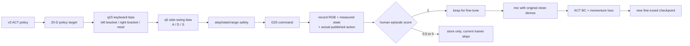
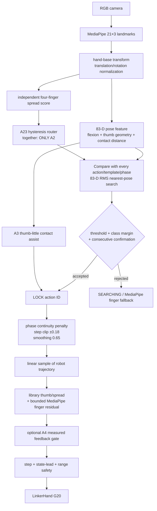

# G20 人工评分 Post-training 与动作库匹配算法

本文记录当前仓库实际运行的两条独立链路：

1. v3 ACT policy 在真机上执行，人类用键盘修正拇指并给整条轨迹评分，然后进行
   post-training。
2. MediaPipe 检测人手姿态，在动作库中选择动作类别和 phase，再生成 DexHand 指令。

> 重要结论：当前 post-training **不是正式的 Monte Carlo RL，也不是 TD(0)**。
> 它是带 episode-level 人工评分筛选的 self-imitation / behavior cloning fine-tune。
> `0` 和 `0.5` 分数据会保存，但当前训练脚本只使用 `1` 分轨迹。

---

## 1. 当前人工评分数据如何采集

运行：

```bash
cd ~/Desktop/Jacky/sims/linker-hand-teleopt
./scripts/collect_g20_v3_thumb_bias.sh
```

执行时：

- 原始 v3 ACT policy 预测 20 维绝对关节目标。
- `[` / `]` 给拇指尖 `q15` 叠加 bias，`\` 将 q15 bias 归零。
- `A` / `D` 给拇指侧摆 `q5` 叠加 bias，`S` 将 q5 bias 归零。
- 除 q5、q15 的人工 bias 外，其余关节继续由 v3 policy 决定。
- 在 `ARMED` 状态按数字 `1`–`8`，可以让已有动作库临时接管。程序会将当前
  DexHand measured state 与指定动作的所有录制帧比较，从最接近的帧继续播放，并在
  动作末端保持。
- 按 `9` 退出动作库接管，清空旧 action chunk，并从当前图像与关节历史恢复 v3 ACT
  policy。当前 `core_actions_v1` 实际包含动作 `1`–`6`；按不存在的 `7`/`8` 只会显示
  unavailable，不会发布错误动作。
- `[` / `]` / `\` 和 `A` / `D` / `S` 的 bias 在 ACT 与动作库接管期间都持续可用，
  切换控制源不会清零。只有 episode 已结束、正在等待评分时，数字 `0`/`5`/`1`
  优先解释为评分。
- bias 后的目标仍经过单帧步长、真机状态和关节范围保护。
- recorder 保存的是**最终实际发布的 safety-limited command**，不是修正前的 policy
  raw output。

每个采样时刻保存：

```text
RGB image
measured joint_pos[20]
actually published last_action[20]
optional touch/mass data
timestamp and episode index
control_source: act_policy 或 action_library_<id>
thumb_tip_bias 与 thumb_side_bias
```

轨迹结束后按：

- `0`：失败，`quality_score = 0`
- `5`：部分成功，`quality_score = 0.5`
- `1`：成功，`quality_score = 1`

当前采集命令包含 `--ignore-touch` 和
`--no-require-touch-for-score-one`，所以最终训练评分完全由人类决定，不会因为触觉
门控把 `1` 自动降为 `0.5`。

数据写入：

```text
data/self_imitation/flipping_v3_human_rated/
└── <timestamp>_act_self_imitation/
    ├── session.json
    └── episode_NNN/
        ├── episode.json
        ├── samples.jsonl
        └── images/*.jpg
```

---

## 2. 为什么它看起来像 Monte Carlo，但实际不是

### 2.1 Monte Carlo 的概念

如果把一条轨迹最后的人类评分记为终止奖励 \(R_T\)，标准 Monte Carlo 方法可以在
episode 结束后，为每个时刻计算完整回报：

\[
G_t = \sum_{k=t}^{T}\gamma^{k-t}r_k
\]

如果只有终止评分，则近似为：

\[
G_t = \gamma^{T-t}R_T
\]

然后可以用 \(G_t\) 学习 \(V(s_t)\)、\(Q(s_t,a_t)\)，或者直接做 policy gradient。
这种方法需要显式的 value/Q/reward model 或 log-probability loss。

### 2.2 当前代码真正做的事情

当前代码只把评分当作 **episode 过滤条件**：

```text
score = 1.0     -> 加入 ACT fine-tune 数据
score = 0.5     -> 保存在磁盘，但当前训练跳过
score = 0.0     -> 保存在磁盘，但当前训练跳过
pending/unrated -> 当前训练跳过
```

训练参数为：

```bash
--min-rated-score 1.0
```

所以当前逻辑可写为：

\[
\mathcal D_{\text{post}}
=
\mathcal D_{\text{clean}}
\cup
\{\tau_i\mid \text{score}(\tau_i)=1\}
\]

模型随后对 \(\mathcal D_{\text{post}}\) 做监督学习：

\[
\theta'
=
\arg\min_\theta
\mathbb E_{(o_t,a_{t:t+H})\sim\mathcal D_{\text{post}}}
\left[
\mathcal L_{\text{ACT}}
+\lambda_m\mathcal L_{\text{momentum}}
\right]
\]

因此更准确的名称是：

```text
reward-filtered behavior cloning
或
elite self-imitation fine-tuning
```

它不包含：

- Monte Carlo return \(G_t\)
- TD target \(r_t+\gamma V(s_{t+1})\)
- value network 或 Q network
- critic
- advantage
- policy-gradient importance ratio
- 用 `0`、`0.5` 数据训练负例或 reward model

### 2.3 为什么当前阶段用这种方法

优点：

- 对真机安全，训练过程不在线探索。
- 只克隆人工确认成功并修正过的动作。
- 不需要训练容易失真的 value/Q model。
- 原始 clean demonstrations 一起训练，可降低只用少量新数据造成的遗忘。

限制：

- `0.5` 分没有比 `0` 分提供更多训练信号。
- 无法显式告诉模型“这个动作比另一个动作好多少”。
- 不学习失败状态的恢复策略。
- 评分只控制整条 episode 是否进入训练，不会定位具体哪几帧出了问题。

如果以后实现真正的 Monte Carlo post-training，可以保留全部评分轨迹，令
\(R_T\in\{0,0.5,1\}\)，训练一个 history-conditioned value/Q model。但这不是当前
脚本已经具备的功能。

---

## 3. 当前 ACT fine-tune 流程

运行：

```bash
cd ~/Desktop/Jacky/sims/linker-hand-teleopt
./scripts/finetune_g20_v3_thumb_bias.sh
```

### 3.1 数据组成

训练脚本组合：

```text
原始 clean demonstrations
data/act_demos_clean/flipping_full_20260722_170628_anyface_v1

+ 人工评分轨迹中所有 score=1 episodes
data/self_imitation/flipping_v3_human_rated
```

所有人工评分成功轨迹都进入 training split；validation 只从没有人工评分的独立 expert
episodes 中抽取，避免把刚收集的自模仿成功轨迹同时放入验证集。

### 3.2 History observation

每个训练样本使用六张历史图像：

```text
t-120, t-96, t-72, t-48, t-24, t
```

在 30 Hz 下覆盖最近约 4 秒，并按时间顺序组成 2×3 mosaic。

关节历史使用：

```text
q(t-120), q(t-90), q(t-60), q(t-30), q(t)
```

每组 20 维，最终 `observation.state` 为 100 维。图像历史和关节历史共同用于区分
“当前画面相似，但此前运动方向不同”的多解状态。

### 3.3 ACT 与 momentum loss

ACT 监督目标是未来 30 帧的 20 维绝对关节 action chunk。

正常 ACT behavior loss 由 LeRobot ACT 本身计算。额外的 momentum loss 对示范和预测
的相邻 action 求速度：

\[
v^{demo}_{t,j}=a^{demo}_{t+1,j}-a^{demo}_{t,j}
\]

\[
v^{pred}_{t,j}=a^{pred}_{t+1,j}-a^{pred}_{t,j}
\]

只在：

\[
|v^{demo}_{t,j}| > 0.01
\]

时启用方向约束，并要求预测速度沿示范方向至少达到：

\[
\min(|v^{demo}_{t,j}|, 0.005)
\]

对应 hinge loss：

\[
\mathcal L_{momentum}
=
\operatorname{mean}
\left[
\max
\left(
0,\,
\min(|v^{demo}|,0.005)
-
v^{pred}\operatorname{sign}(v^{demo})
\right)
\right]
\]

最终：

\[
\mathcal L
=
\mathcal L_{ACT}
+0.2\,\mathcal L_{momentum}
\]

示范轨迹真实发生反向时，`sign(v_demo)` 也会反向，因此 momentum 不会禁止合法的
动作回程。

### 3.4 Fine-tune 设置

当前脚本：

```text
初始化 checkpoint: v3 / 030000
learning rate:       3e-6
fine-tune steps:     5000
batch size:          8
chunk size:          30
n_action_steps:      30
momentum weight:     0.2
```

新模型保存到：

```text
artifacts/g20_flipping_act_v3_thumb_bias_ft_v1/
training/checkpoints/005000/pretrained_model
```

---

## 4. Post-training 数据流



---

## 5. 动作库包含什么

动作库目录：

```text
data/action_library/g20_right/core_actions_v1/
```

每个 primitive 包含：

- 一个动作 ID 和名称。
- 一条 DexHand `T×20` SDK-range robot trajectory。
- 多条人类 MediaPipe hand templates。
- 每个类别自己的接受阈值 `threshold`。
- phase mapping 设置。

当前 `manifest.json` 的 feature profile 是：

```text
finger_flexion_thumb_little_contact_v2
```

这表示普通四指侧向张开不会直接进入主要动作匹配特征，但保留完整的拇指 3D 几何和
“拇指尖—小拇指尖”3D 距离。

---

## 6. MediaPipe 手姿如何变成 83 维匹配特征

输入是已经转换到 hand-base 坐标系的 21 个三维 landmark：

\[
L\in\mathbb R^{21\times3}
\]

### 6.1 平移和尺度归一化

先令 wrist landmark 0 为原点：

\[
\tilde L_i=L_i-L_0
\]

掌宽使用 index MCP 5 到 little MCP 17：

\[
s=\|\tilde L_5-\tilde L_{17}\|_2
\]

所有距离特征除以 \(s\)，因此匹配基本不依赖手的绝对大小和摄像机距离。

### 6.2 特征组成

83 维特征由以下部分组成：

1. 20 条骨骼单位方向，每条 3 维：`20 × 3 = 60`
2. 五根手指链内部弯曲角：`14`
3. 拇指尖到其余四个指尖的归一化距离：`4`
4. wrist 到五个指尖的归一化距离：`5`

总计：

\[
60+14+4+5=83
\]

对 index、middle、ring、little 的方向和角度，当前 profile 会将 hand-base 横向
分量设为 0，从匹配中去掉普通四指 splay。唯一例外是第 77 维：

```text
thumb-tip 到 little-tip 的完整 3D 归一化距离
```

因此：

- 四指弯曲仍用于动作识别。
- 四指横向张开不会污染主要 pose distance。
- 拇指和小拇指接近/离开仍可用于动作 3。

---

## 7. 当前 `live-pose` 动作匹配算法

当前命令使用：

```bash
--tracking-mode live-pose
```

所以使用 `LivePoseMatcher`。它不是整段 DTW，而是**每个摄像机帧进行最近姿态搜索**，
再用锁定和滞回保持时间连续。

### 7.1 当前姿态到每个模板帧的距离

当前特征为 \(x\in\mathbb R^{83}\)。动作类别 \(p\) 的第 \(k\) 条示范模板，在模板帧
\(j\) 的特征为 \(T_{p,k,j}\)。

距离为 83 维 RMS：

\[
d_{p,k,j}
=
\sqrt{
\frac{1}{83}
\sum_{f=1}^{83}
(T_{p,k,j,f}-x_f)^2
}
\]

如果类别已经锁定，为选择连续 phase，会临时增加 phase continuity penalty：

\[
\tilde d_{p,k,j}
=
d_{p,k,j}
+0.010|\phi_{p,k,j}-\phi_{current}|
\]

它只帮助选择模板帧，最终报告和阈值检查仍使用原始 RMS distance。

每条模板取最佳帧，每个动作类别再取最佳人类示范：

\[
(d_p,\phi_p)
=
\min_k\min_j(d_{p,k,j},\phi_{p,k,j})
\]

所有动作类别按 \(d_p\) 从小到大排序。

### 7.2 第一次锁定动作

最佳动作必须同时满足：

\[
d_{best}
\le
\text{threshold}_{best}\times1.20
\]

以及类别分离：

\[
d_{second}-d_{best}\ge0.015
\]

同一个候选连续满足 2 帧后才进入 `LOCKED`。如果使用 `--primitive-id` 强制指定类别，
只需要 1 帧。

### 7.3 已锁定后的切换与释放

已经锁定类别 \(c\) 后：

- 继续在动作 \(c\) 的所有模板中找最近 phase。
- 另一个动作只有比当前动作至少好 `0.015`，或者当前动作已经超过阈值，才成为切换
  候选。
- 新类别连续 2 帧满足条件才正式切换。
- 当前类别连续 4 帧超过自己的阈值时解除锁定，返回 `out_of_library`。

这避免一个噪声帧让动作 ID 来回跳动。

### 7.4 Phase 平滑

最近模板帧给出 raw phase \(\phi_{raw}\)。每帧先限制最大 phase 差：

\[
\Delta
=
\operatorname{clip}
(\phi_{raw}-\phi_{old},-0.18,+0.18)
\]

然后：

\[
\phi_{new}
=
\operatorname{clip}
(\phi_{old}+0.65\Delta,0,1)
\]

`live-pose` 允许 phase 前进或后退，所以人手把动作倒着做时，DexHand 也可以沿轨迹
返回。

### 7.5 从 human phase 到 robot command

匹配得到 \(\phi\in[0,1]\) 后，在该动作的 DexHand trajectory 上线性采样：

\[
u=(T_{robot}-1)\phi
\]

取相邻帧：

\[
q^{lib}(\phi)
=(1-\alpha)q_{\lfloor u\rfloor}
+\alpha q_{\lceil u\rceil}
\]

所以 human template 和 robot trajectory 不需要具有相同帧数；两者通过归一化 phase
对应。

---

## 8. 动作 2 / 3 的四指开合路由

动作 2 和动作 3 的拇指姿态相近，因此在主要 83 维匹配之外，系统独立计算四指
splay：

1. 取 index、middle、ring、little 指尖的 hand-base 横向坐标。
2. 求三个相邻指尖横向距离的平均值。
3. 除以掌宽。

\[
spread
=
\frac{
\operatorname{mean}
(
|y_8-y_{12}|,
|y_{12}-y_{16}|,
|y_{16}-y_{20}|
)
}{
\|L_5-L_{17}\|_2
}
\]

当前参数：

```text
threshold  = 0.350
hysteresis = 0.030
```

状态切换为：

```text
初次判断：
    spread >= 0.350 -> fingers-open
    spread <  0.350 -> fingers-together

已经 together：
    spread >= 0.380 才切换到 open

已经 open：
    spread <= 0.320 才切换到 together
```

在 `fingers-together` 状态：

- 动作库硬排除所有非 A2 动作。
- A3 contact assist 被禁止。
- hybrid 模式下四根手指也被冻结在 A2 库轨迹，MediaPipe residual 不再改变它们。

在 `fingers-open` 状态：

- 所有动作重新允许参与正常距离竞争。
- 不是强制 A3；A3 仍需通过 pose distance 或 contact assist。

如果命令使用：

```bash
--no-a23-spread-routing
```

上述硬路由完全关闭。

---

## 9. 动作 3 的 contact assist

A3 的公共 open pose 与其他动作太相似，所以普通类别间隔有时无法早期锁定。A3
contact assist 使用第 77 维“拇指尖—小拇指尖距离”辅助获取 phase。

激活条件：

```text
A3 distance <= A3 threshold × 1.60
A3 distance <= 最佳非 A3 distance + 0.015
raw phase >= 8%
连续满足 2 帧
```

同时，已经锁定的非 A3 动作不会被 A3 assist 中途抢占。

A3 是 round-trip phase：

```text
0%  -> 70%：拇指向小拇指靠近
70%：最小 thumb-little 距离，即接触附近
70% -> 100%：拇指从小拇指移开并返回
```

接触距离用于判断已经进入 outward branch，因此相似的几何位置可以根据此前是否已经
到达接触点映射到不同 phase。

---

## 10. Hybrid control 如何组合动作库与 MediaPipe

当前常用配置：

```bash
--control-mode hybrid-fingers
--hybrid-unlocked-fingers
```

动作锁定时：

- 动作库严格控制拇指：`q0/q5/q10/q15`
- 动作库严格控制四指侧摆：`q6..q9`
- MediaPipe 只对四指屈伸提供有界 residual：
  - base：`q1..q4`
  - tip：`q16..q19`

对某一组四指屈伸关节：

\[
r
=
\operatorname{clip}
\left(
\alpha(q^{MP}-q^{lib}),
-r_{max},
+r_{max}
\right)
\]

\[
q^{target}=q^{lib}+r
\]

当前典型值：

```text
base blend = 0.15, residual limit = 20
tip blend  = 0.20, residual limit = 25
```

未锁定且允许 fallback 时：

- 四指屈伸直接使用 MediaPipe。
- 拇指和四指侧摆保持最后一个 library anchor。

A2/A3 router 处于 `fingers-together` 时例外：四指也被冻结，只能执行 A2 的库目标。

---

## 11. 数字键“从最接近真机姿态开始”是另一套匹配

数字键播放不使用 MediaPipe 83 维特征。它比较当前 DexHand measured pose 与指定动作
robot trajectory 的每一帧。

对 16 个活动关节：

```text
q0..q10, q15..q19
```

忽略保留槽位：

```text
q11..q14
```

最近帧误差：

\[
e_j
=
\sqrt{
\frac{1}{16}
\sum_{i\in active}
(q^{traj}_{j,i}-q^{current}_i)^2
}
\]

选择：

\[
j^*=\arg\min_j e_j
\]

然后从 \(j^*\) 开始播放剩余 trajectory。距离相同则 `np.argmin` 选择更早的帧，以保留
更多后续动作。

在人工评分 post-training 采集程序中，动作播放结束后不会立刻交还 policy，而是保持
动作库最后一帧，直到按 `9`。切回 ACT 时会清空之前缓存的 action chunk，避免继续执行
介入前的旧预测；图像历史和 measured-state history 保留，因此 policy 是从当前场景
重新规划。无论由 ACT 还是动作库控制，q15/q5 键盘 bias 都叠加在最终目标上。

特殊按键 6 的 thumb round-trip 只使用：

```text
q0/q5/q10/q15
```

找动作 2 的最近帧，执行到动作 2 终点，再倒放回动作 2 第 1 帧；其他四指关节固定在
按键瞬间的真机状态。

---

## 12. 最终真机安全层

无论目标来自动作库、MediaPipe、数字键播放还是 hybrid residual，发布前都经过：

1. 每帧相对上一条 command 的最大变化：

\[
|q^{cmd}_t-q^{cmd}_{t-1}|
\le \text{max-range-step}
\]

2. command 相对 measured state 的最大领先量：

\[
q^{state}-\text{max-state-lead}
\le q^{cmd}
\le q^{state}+\text{max-state-lead}
\]

3. SDK range `0..255`。
4. 保留槽位 `q11..q14 = 255`。
5. state stale、hand lost 和 reset/A4 feedback gate。

A4 还有独立的测量反馈顺序约束：

```text
先让 q0/q5/q10 左对齐
-> 连续 3 帧误差 <= 5
-> 保持左姿态并关闭 q15
-> 连续 3 帧误差 <= 5
-> 才释放向右转动
```

这个 gate 属于动作选择后的执行保护，不参与动作类别 distance。

---

## 13. 整体匹配流程



---

## 14. 对两个系统的简短总结

### Post-training

```text
当前：人工评分筛选成功轨迹 + supervised ACT fine-tune + momentum
不是：Monte Carlo value learning
不是：TD(0)
```

### 动作库匹配

```text
当前 AUTO live-pose：
单帧 83-D 最近姿态
+ 类别阈值与 margin
+ 连续帧确认与切换滞回
+ 双向 phase 平滑
+ A2/A3 四指开合硬路由
+ A3 thumb-little contact assist
```

数字键最近帧则是：

```text
当前 DexHand 20-D state
-> 16 个活动关节 RMS
-> 指定 robot trajectory 的最近帧
-> 从该帧继续播放
```

---

## 15. 对应代码

- 人工评分录制：
  `src/comms/visual_act_to_linkerhand.py` 中的 `RatedAttemptRecorder`
- q15/q5 键盘修正：
  `src/comms/visual_act_to_linkerhand.py`
- 数字 `1`–`8` 动作介入和 `9` 恢复 ACT：
  `src/comms/visual_act_to_linkerhand.py` 中的 `ActionLibraryIntervention`
- 数据筛选、history 构建和 fine-tune：
  `scripts/train_g20_visual_act.py`
- momentum loss：
  `scripts/lerobot_train_momentum.py`
- 当前采集脚本：
  `scripts/collect_g20_v3_thumb_bias.sh`
- 当前 fine-tune 脚本：
  `scripts/finetune_g20_v3_thumb_bias.sh`
- 83 维特征和 `LivePoseMatcher`：
  `src/comms/action_library.py`
- A2/A3 router、A3 assist、hybrid control 和安全发布：
  `src/comms/action_library_phase_teleop.py`
- 当前动作库配置：
  `data/action_library/g20_right/core_actions_v1/manifest.json`

---

## 16. 离线消融表（2026-07-27）

下面的结果完全使用已录制数据，不连接 ROS、不打开真机相机、也不发布任何关节命令。
三个 checkpoint 都在同一组 v3 held-out 轨迹上评估：

```text
flipping_full_20260722_170628_anyface_v1/episode_005
flipping_full_20260722_170628_anyface_v1/episode_009
flipping_full_20260722_170628_anyface_v1/episode_012
```

每条轨迹均匀选择 8 个时刻，共 24 个评估时刻。每个时刻预测完整 30 帧 action
chunk；排除保留通道 `q11..q14`，并在计算前把输出裁剪到 SDK 的 `0..255` 范围。
下面四项都是越低越好：

| Variant | Chunk MAE (ticks) | Direction disagreement | Boundary jump (ticks) | Chunk-end MAE (ticks) |
|---|---:|---:|---:|---:|
| ACT | 55.76 | 40.1% | 12.55 | 57.80 |
| + MP + action library | N/A | N/A | N/A | N/A |
| + history states | 9.83 | 30.2% | 4.76 | 11.18 |
| + momentum | 4.10 | 22.3% | 2.24 | 3.84 |
| + posttraining | N/A | N/A | N/A | N/A |

指标含义：

- `Chunk MAE`：30 帧预测 chunk 与 demonstration action 的活动关节平均绝对误差。
- `Direction disagreement`：demonstration 相邻动作变化至少 1 tick 时，预测变化方向
  相反或为零的比例。
- `Boundary jump`：执行 30 帧后，用对应 recorded observation 重新规划，新 chunk
  第一帧与旧 chunk 最后一帧之间的活动关节平均跳变。
- `Chunk-end MAE`：预测 chunk 第 30 帧与 demonstration 对应动作的误差。

`+ MP + action library` 是采集和 hybrid teleop 逻辑，目前没有一个只加入该模块的独立
ACT checkpoint；`+ posttraining` 已有人工评分数据集，但还没有训练完成的 checkpoint，
因此这两行不能离线计算。基础 ACT、history ACT 和 momentum v3 的训练数据也不完全相同，
所以这是现有模型的描述性比较，不是严格控制变量的消融实验。

原表的 `Success`、`stay in hand` 和 `average success time` 必须通过真机 rollout
测量，不能从 demonstration 离线推断。可复现脚本和完整逐样本结果分别位于：

```text
scripts/compare_g20_act_offline.py
artifacts/offline_ablation_20260727/offline_ablation.json
artifacts/offline_ablation_20260727/offline_ablation.md
```


# post training


cd ~/Desktop/Jacky/sims/linker-hand-teleopt
./scripts/collect_g20_v3_thumb_bias.sh


# fine tune 
cd ~/Desktop/Jacky/sims/linker-hand-teleopt
./scripts/finetune_g20_v3_thumb_bias.sh

---

## 18. 2026-07-28 人工介入数据审计与推荐 post-training

今天共录制 48 条 rated episodes、35,406 个原始 samples；所有 episode 的图片数量与
sample 数一致。其中：

```text
score=1:  12 条，14,899 samples
score=0:  36 条，20,507 samples
score=0.5: 0 条
```

最后一个 session `20260728_154948_act_self_imitation` 有两条成功轨迹：

- `episode_001`：ACT policy + q15/q5 人工 bias。
- `episode_003`：前 105 samples 使用动作库 A2，随后按 `9` 回到 ACT，并使用少量 q15
  bias。

今天的 rated recorder 实际约为 15 Hz，而原 v3 expert demonstrations、history offsets
和 30-frame action chunk 按 30 Hz 定义。新训练脚本使用
`--resample-rated-to-fps`，根据 `elapsed` 时间戳把 rated state/action 线性插值回
30 Hz，图像使用时间上最近的真实帧，避免把 4 秒 history 错当成约 8 秒。

推荐运行：

```bash
cd ~/Desktop/Jacky/sims/linker-hand-teleopt
./scripts/finetune_g20_v3_20260728.sh
```

这次采用保守的 post-training：

- 只接收今天 `score=1` 的轨迹；0 分数据保留在磁盘但不进入 behavior cloning。
- 原 v3 的两组 clean expert data 都作为 replay anchor。
- 从 v3 30K checkpoint 初始化，学习率 `1e-6`，训练 3K steps，batch size 16。
- 使用 `edge-head` 冻结策略，只更新第一层视觉 cross-attention、对应 normalization 和
  action head。
- v3 同时作为 teacher；clean replay 对 teacher 的约束权重为 2.0，今天成功数据为
  0.1。distillation 约束四指关节，允许拇指 q0/q5/q10/q15 从人工修正中适应。

这里不再次加入 momentum loss，因为当前训练器不允许 momentum 与 distillation 同时
使用。v3 已经包含 momentum 行为，而且 decoder/self-attention motion prior 在
`edge-head` 模式下被冻结保留；这比全模型再用 momentum fine-tune 更不容易破坏原先
已经能工作的完整翻转轨迹。
